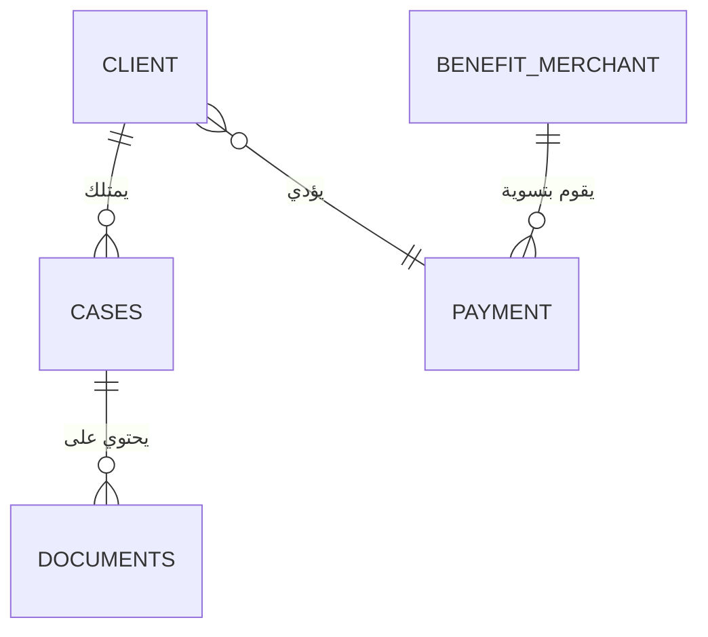
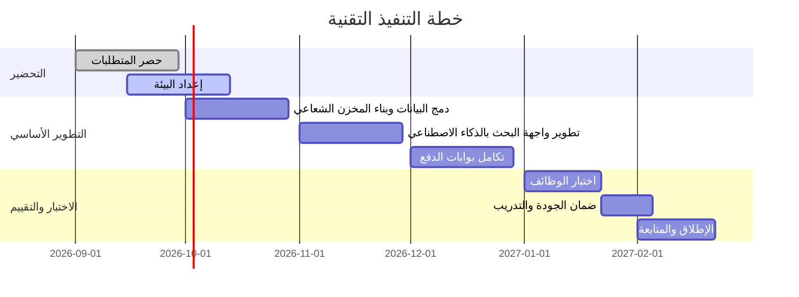

<!-- markdownlint-disable MD013 -->

# الملخص التنفيذي

في المملكة البحرينية تتوفر مصادر بيانات قانونية متعددة يمكن استغلالها لتعزيز لوحة تحكم إدارة المكتب القانوني. مثلاً، يوفر بوابة البيانات المفتوحة البحرينية التي تشرف عليها هيئة المعلومات والحكومة الإلكترونية (IGA) مجموعات بيانات عن النظام القضائي مثل **“القضايا القضائية حسب الأنواع والمستويات”**، و**“حالات الزواج حسب الجنسية وعدد الزوجات وفئات أعمار الزوج”**، و**“حالات الطلاق حسب فئات العمر والجنسية والجنس”**. كما توجد بيانات جغرافية للمكاتب الحكومية (بما فيها المحاكم) مثل مجموعة **“المواقع الجغرافية للمكاتب الحكومية”**.

من جهة أخرى، تحوي مصادر رسمية أخرى نصوصاً تشريعية أساسية (الدستور، القوانين، اللوائح)، رغم أنها متاحة عادة بصيغ PDF أو HTML ولا يوجد لها واجهات برمجة علنية. سنستعرض أدناه الجرد التفصيلي للبيانات والنصوص القانونية، ونشرح المزايا العملية التي يمكن إضافتها إلى لوحة التحكم، بالإضافة إلى تصميم معماري لاستخدام نموذج ذكاء اصطناعي تَصَيُّدِي (RAG) لمراجعة القوانين والإجابة على الأسئلة، وتفاصيل تقنية (Routes، نماذج بيانات، مكونات واجهة) وخطط التنفيذ اللازمة، مع الأخذ بالاعتبار الضوابط القانونية والتشريعية في البحرين.

## 1. جرد مجموعات البيانات (Inventory)

فيما يلي جرد لأهم المجموعات البيانات المفيدة لإثراء أدمن داشبورد مكتب المحاماة، مأخوذة من بوابة البيانات المفتوحة وغيره من المصادر الرسمية:

<!-- markdownlint-disable MD060 -->
| **المجموعة**                                                                                                   | **الوصف المختصر**                                                                                           | **الحقول الرئيسية**                                                                       | **وسيلة الوصول**                                                                                                                                    | **تكرار التحديث**                                    | **الترخيص**               | **مثال استعلام API**                                                                                                  |
| -------------------------------------------------------------------------------------------------------------- | ----------------------------------------------------------------------------------------------------------- | ----------------------------------------------------------------------------------------- | --------------------------------------------------------------------------------------------------------------------------------------------------- | ---------------------------------------------------- | ------------------------- | --------------------------------------------------------------------------------------------------------------------- |
| **Judicial Cases by Different Types and Levels** (قضايا قضائية حسب الأنواع والمستويات)                         | إحصاءات سنوية عن عدد القضايا (القائمة والحلول) مصنفة حسب نوع القضية (أول درجة/مستئناف) ونوع الدعوى والقضاء. | _year_ (السنة)، _type_ (نوع القضية)، _new_, _resolved_, _pending_, _clearance_rate_، إلخ. | API: `https://bahrain.opendatasoft.com/api/records/1.0/search/?dataset=01-judicial-cases-by-different-types-and-levels` (JSON). كما يمكن تنزيل CSV. | سنوي                                                 | Bahrain Open Data License | `GET /api/records/1.0/search/?dataset=01-judicial-cases-by-different-types-and-levels&rows=5&sort=-year`              |
| **Marriage Cases by Nationality, No. of Wives, Age** (حالات الزواج حسب الجنسية وعدد الزوجات وفئات أعمار الزوج) | بيانات سنوية عن عدد قضايا الزواج مصنفة حسب جنسية الزوج، عدد الزوجات، وفئة العمر.                            | _year_, _nationality_, _wives_count_cat_, _husband_age_group_, _cases_count_.             | API مشابه فوق dataset=`marriage-cases-by-nationality-number-of-wives-and-age-groups-of-husband`.                                                    | سنوي                                                 | Bahrain Open Data License | `GET /api/records/1.0/search/?dataset=marriage-cases-by-nationality-number-of-wives-and-age-groups-of-husband&rows=5` |
| **Divorce Cases by Nationality, Age & Sex** (حالات الطلاق حسب الجنسية، العمر والجنس)                           | بيانات سنوية عن عدد قضايا الطلاق مصنفة حسب جنسين الأزواج، الفئة العمرية والجنسية.                           | _year_, _nationality_, _age_group_, _sex_, _cases_count_.                                 | API dataset=`divorce-cases-by-age-groups` (JSON).                                                                                                   | سنوي                                                 | Bahrain Open Data License | `GET /api/records/1.0/search/?dataset=divorce-cases-by-age-groups&rows=5`                                             |
| **Geographical Locations of Government Offices** (المواقع الجغرافية للمكاتب الحكومية)                          | خريطة مواقع تشمل كل الوزارات والمكاتب الحكومية والمحاكم مع إحداثيات GPS. مفيد لربط بيانات المكاتب والمحاكم. | _office_name_, _category_ (مثل محاكم/وزارات)، _governorate_, _latitude_, _longitude_.     | API dataset=`geographical-locations-of-government-offices`.                                                                                         | غير متغير غالباً (إضافي أو معدّل عند تغيير المواقع). | Bahrain Open Data License | `GET /api/records/1.0/search/?dataset=geographical-locations-of-government-offices&rows=10`                           |
| **National Summary Data (NSDP)** (البيانات القومية الموجزة)                                                    | بيانات اقتصادية واجتماعية عامة (مثل النمو السكاني حسب المنطقة). يمكنها إثراء التقارير والتحليلات.           | يعتمد على الملف (GDP، سكان، ...).                                                         | API/CSV (بحسب كل مجموعة بيانات داخل NSDP).                                                                                                          | سنوي                                                 | Bahrain Open Data License | (مثال: `dataset=nsdp-demographics-202x`)                                                                              |
| **Ministry of Justice Services Statistics** (إحصاءات خدمات وزارة العدل)                                        | (مورد مُطلوب البحث)، قد توجد تقارير أو بيانات حول سير العمل القضائي أو عمر الدعاوى في موقع وزارة العدل.     |                                                                                           | PDF/HTML تقارير صادرة، أو بوابة خدمات الوزارة (Najmah)                                                                                              | حسب النشر الدوري                                     | -                         | -                                                                                                                     |

> **ملاحظة:** جميع بيانات بوابة البيانات المفتوحة البريطانية محمية برخصة حكومة البحرين للبيانات المفتوحة، ما يعني إمكانية الاستخدام وإعادة النشر بشروط محدودة. وللوصول إلى الـ APIs يتطلب الحصول على مفتاح API من المنصة، وإذا كان الوصول محظوراً لجمهور، نعلّق “يتطلب انضمامًا” حتى الحصول على الإذن الرسمي.

## 2. النصوص القانونية واللوائح الأساسية

نشير فيما يلي إلى أهم النصوص القانونية البحرينية ذات الصلة بعمل المكتب القانوني، ونوضح ما إذا كانت متاحة بواجهات أو بتنزيل مباشر:

- **دستور مملكة البحرين (2002 المعدل 2017):** متاح كنص رسمي في الجريدة الرسمية. لا يوجد API؛ يمكن تحميله كملف PDF من مصادر مثل موقع _Mena Rights Group_ أو مواقع الدولة. الترخيص: الدستور خارج الملكية الفكرية (بدائي).
- **القوانين المدنية والتجارية:** مثل _قانون المعاملات المدنية الصادر بالمرسوم بقانون 19/2001_ (مع تعديلات لاحقة)، _قانون المرافعات المدنية والتجارية 12/1971_، وغيرها. معظمها منشورة على بوابة التشريعات (`www.iga.gov.bh` أو `moj.gov.bh`) بصيغ PDF/HTML. لا توجد واجهة برمجة معلنة. الترخيص: من الناحية العملية عامة (قوانين تشريعية).
- **القوانين الجزائية:** _قانون العقوبات رقم 15/1976_ والتعديلات (أحدثها قانون 25/2025)، بالإضافة إلى _قانون الإجراءات الجنائية_ وغيرها. متاحة كمرفقات في الجريدة الرسمية وموقع التشريعات.
- **قوانين الأحوال الشخصية:** نظامي المحاكم الشرعية (السنّي والجعفري) وقانون أحكام الأسرة (سُني 1956)، وقانون الأحوال الشخصية الشيعي (الجعفري) 31/1989. متوفرة في مصادر قانونية حكومية.
- **قوانين الشركات والاقتصاد:** مثل _قانون الشركات التجارية 21/2001_، _قانون الأوراق التجارية 29/1987_، وغيرها، ومجموعة القوانين التابعة لمجلس التنمية الاقتصادية (قوانين تشجيع الاستثمار).
- **قوانين تنظيم المهنة والمحاماة:** قانون المحاماة رقم 27/2000 وغيرها.
- **التشريعات التنظيمية واللوائح الحكومية:** مثل تنظيم القضاء (الديوان الملكي 13/1971)، تنظيم التنفيذ، وغيرها. وغالبًا توجد من دون API وتُنشر في الجريدة الرسمية.
- **تعليقات أو مذكرات تفسيرية:** لا توجد عادة مصادر مفتوحة؛ معظمها في كتب أو منشورات أكاديمية.

<!-- markdownlint-enable MD060 -->

<!-- markdownlint-disable MD060 -->
| **النص القانوني**                           | **التوفر** | **الصيغة**   | **الرابط/التنزيل**             | **الترخيص**        |
| ------------------------------------------- | ---------- | ------------ | ------------------------------ | ------------------ |
| دستور مملكة البحرين (2002)                  | PDF/HTML   | عربي/إنجليزي | [تحميل PDF إنجليزي]            | ملكية عامة (دستور) |
| قانون المعاملات المدنية (19/2001)           | PDF/HTML   | عربي         | (جريدة رسمية / بوابات تشريعات) | ملكية عامة         |
| قانون المرافعات المدنية والتجارية (12/1971) | PDF/HTML   | عربي         | "                              | ملكية عامة         |
| قانون العقوبات (15/1976)                    | PDF/HTML   | عربي         | (الموقع التشريعات الحكومي)     | ملكية عامة         |
| قانون العقوبات التعديلات (25/2025)          | PDF/HTML   | عربي         | (وزارة العدل، التشريعات)       | ملكية عامة         |
| قانون الشركات التجارية (21/2001)            | PDF/HTML   | عربي         | (بوابة التشريعات، EGB)         | ملكية عامة         |
| قانون تنظيم المهنة (27/2000)                | PDF/HTML   | عربي         | (وزارة العدل)                  | ملكية عامة         |
| قواعد السلوك المهني (قانون المحاماة)        | PDF/HTML   | عربي         | (وزارة العدل)                  | ملكية عامة         |

> **ملاحظة:** لا توجد واجهات API للوثائق التشريعية الرسمية؛ لأنها تُعرض عادة على شكل نص (HTML/PDF). على المكتب احترام حقوق النشر للبعض منها، وإن كانت نصوص التشريعات تُعتبر عموماً خارج الملكية الفكرية.

## 3. مقترحات الميزات (Value Propositions)

باستخدام مجموعات البيانات والنصوص السابقة، يمكن إضافة الميزات التالية إلى لوحة التحكم لتعزيز قيمة الأتمتة واتخاذ القرار:

<!-- markdownlint-enable MD060 -->

<!-- markdownlint-disable MD060 -->
| **الميزة**                                       | **البيانات/المصادر المطلوبة**                                  | **تقدير التعقيد** | **تقدير الأثر** | **ملاحظات**                                                                                                                                 |
| ------------------------------------------------ | -------------------------------------------------------------- | ----------------- | --------------- | ------------------------------------------------------------------------------------------------------------------------------------------- |
| مكتبة قانونية قابلة للبحث                        | نصوص الدستور والقوانين (PDF/HTML)                              | منخفض             | عالي            | إمكانية البحث بالكلمات المفتاحية؛ يدعم العربي/الإنجليزي. لا حاجة APIs، فقط أرشفة PDF نصية.                                                  |
| اقتراح تصنيف القضايا تلقائياً (Tagging)          | إحصاءات القضايا المفتوحة (Dataset عن القضايا)                  | متوسط             | عالي            | استخدام ML لتصنيف القضية ضمن الفئات القضائية، يدعم الإدارة. يتطلب معالجة بيانات تاريخية.                                                    |
| مزامنة تقويم المحاكم (Court Calendar Sync)       | مصادر خارجية (يوميات المحاكم، إن وجدت)                         | عالي              | متوسط           | إذا توفر API أو iCal من المحاكم، يمكن جلب الجلسات وربطها بحسابات القضايا. قد يتطلب اتفاق مع القضاء.                                         |
| ملفات القضاة والهيئات القضائية (Judge Profiles)  | بيانات حكومية (إن وجدت) أو الداخلية                            | متوسط             | متوسط           | إنشاء ملفات للمحكمة والقضاة مع تخصصاتهم، أخبارهم. قد يتطلب إدخال يدوي أو الحصول من وزارة العدل.                                             |
| بحث بالنماذج/السوابق القضائية (Precedent Search) | نصوص اللوائح والقوانين، وصياغة الذكاء الاصطناعي (RAG)          | عالي              | عالي            | يسمح بالبحث عن نص قانوني أو مبدأ قضائي في المستندات القانونية باستخدام RAG لضمان المصداقية. يحتاج قاعدة نصوص منظمة.                         |
| تقدير المخاطر/الأثر (Risk Scoring)               | بيانات القضايا التاريخية/إحصاءات القضاء                        | متوسط             | متوسط           | تحليل اتجاهات القضايا لتقييم احتمالات النجاح أو تأخير القضايا، وتحديد المحاكم المكتظة. يعتمد على جودة البيانات التاريخية.                   |
| توليد المستندات القانونية (Auto-Drafting)        | قوالب ومستندات سابقة (Law Docs Templates)                      | عالي              | متوسط-عالي      | استخدام النماذج الشرطية لإعداد مسودات المستندات (عقود، مذكرات)، مع قدرة ملء بيانات العميل تلقائياً. يتطلب قواعد بيانات حول أنواع المستندات. |
| إثراء بيانات العميل (Client Intake Enrichment)   | بيانات مفتوحة مثل مواقع الجغرافيا، ومعلومات ديموغرافية         | منخفض             | متوسط           | عند إدخال بيانات العميل، يستخدم عنوانه لاستخراج مكتب الوزارة القريب أو إحصاءات المنطقة لتحسين الخدمة. يتطلب ربط API للمواقع المفتوحة.       |
| لوحات تحليلات وإحصاءات (Analytics Dashboard)     | جميع البيانات المفتوحة (القضايا، ديموغرافيا) واستطلاعات داخلية | متوسط             | عالي            | عرض مؤشرات مثل عدد القضايا حسب النوع، الإنجازات الشهرية، توزيع العملاء. يستفيد من دمج البيانات المفتوحة مع بيانات المكتب.                   |

<!-- markdownlint-enable MD060 -->

> **أولوية التطبيق:** ننصح بالبدء بـ«مكتبة قانونية قابلة للبحث» و«بحث بالنماذج/السوابق» لسهولة التنفيذ والأثر الكبير؛ ثم «اقتراح تصنيف القضايا» و«لوحات التحليلات»، تليها ميزات مثل «التقويم القضائي» و«الملفات القضائية» حسب توفر البيانات.

## 4. تصميم نظام Retrieval-Augmented Generation (RAG) للذكاء الاصطناعي

لتمكين النموذج الحالي (على سبيل المثال GPT) من مراجعة القوانين والإجابة على أسئلة القضايا بدقة، نقترح بنية **توليد معزز بالاسترجاع (RAG)** مفصلة:

- **استخلاص البيانات (Data Ingestion):**
  - اجمع نصوص التشريعات واللوائح القانونية من مصادر رسمية (PDF/HTML). إذا كانت مُمسحة ضوئياً، استخدم OCR (مثلاً _Tesseract_ أو خدمة AWS Textract).
  - استخرج الميتاداتا (العنوان، رقم المادة/المادة) بتنظيمها في قاعدة بيانات. قسم النصوص إلى مقاطع منطقية (chunking) مثلاً لكل مادة قانونية أو فقرة.
- **تخزين الشعاعيات (Vector Store):**
  - اختر مخزن شعاعي (Vector Store) مناسب. مثلاً **Weaviate** مفتوح المصدر أو **Pinecone** سحابي مدعوم AWS لدعم كثافة الاسترجاع والسكيل. Weaviate يدعم اللغة العربية وميزات Semantic Search. يمكن أيضاً الاستفادة من **Amazon Kendra** أو **AWS Bedrock** (حيث أُعلن تكامله مع iGA).
  - قم بتوليد المتجهات Embeddings للمقاطع القانونية باستخدام نموذج متعدد اللغات أو مخصص للعربية (مثل _Arabic BERT_ أو _LaBSE_). يمكن استخدام _LangChain_ لبناء خطوط أنابيب الاسترجاع.
- **استراتيجية التجزئة (Chunking):**
  - قسم النص القانوني إلى فقرات أصغر (كل مادة أو بند). يجب أن يحتفظ كل chunk بالسياق الكافي (مثلاً جمّل سوابق أو مراجع نصوص الدستور).
  - كل chunk يخزن مع بياناته الوصفية (القانون/المادة/رقم الصفحة) لتسهيل الاستشهاد.
- **آلية الاسترجاع (Retrieval Pipeline):**
  - عند استلام استعلام المستخدم، يُجرى البحث أولاً عبر المخزن الشعاعي لاسترجاع أبرز Chunks ذات الصلة (استرجاع سباق مع تبسيط النتائج).
  - ثم يرسل النموذج هذه المقاطع في الـPrompt إلى نموذج اللغة (LLM) ضمن تعليمات واضحة بإجمالي الصيغة (مثلاً: “أجب استناداً إلى النصوص التالية مع الاستشهاد بالمواد”).
- **الهندسة التحفيزية (Prompt Engineering):**
  - جهز Prompts ثنائية اللغة (بالعربي/الإنكليزي) تطلب من النموذج الإجابة النصية مع اقتباس دقيق “كما ورد في المادة X” لمنع الهلوسة.
  - قدم سياقاً قصيراً يوضح أنه “مستند قانوني رسمي”.
- **التخفيف من الهلوسة والمصداقية:**
  - طلب توثيق الإجابة بأرقام المواد.
  - استخدام Retrieval لإجبار النموذج على مصادر موثوقة (chunks مفهرسة).
- **التعامل مع التحديثات:**
  - جدولة إعادة فهرسة (إعادة بناء الشعاعيات) بشكل دوري، خاصة بعد إصدار قوانين جديدة.
  - تتبع نسخ التشريعات مع تاريخ النشر في الميتاداتا لضمان الإجابة وفق أحدث النصوص.
- **دعم ثنائي اللغة والاتجاه (RTL):**
  - تكوين المخزن الشعاعي لدعم اللغة العربية والإنكليزية. يمكن ترميز الـEmbeddings بإما نموذج متعدد اللغات أو نموذجين منفصلين.
  - **RTL:** معظم أدوات NLP الحديثة تدعم العربية بالنص العادي. تأكد من محاذاة النصوص في واجهة المستخدم (لا يؤثر في عمليات الاسترجاع).
- **أدوات مقترحة:** LangChain (لإنشاء الـRAG pipeline)، Weaviate أو Pinecone (مخزن متجهات)، Elasticsearch (للبحث التقليدي)، Amazon Bedrock (خدمات NLP جاهزة مع ضمان ضوابط أمنية محلية)، وغيرها حسب الاتفاق مع الجهات الحكومية.

```mermaid
flowchart TD
    subgraph Data_Preparation
      A[Raw Legal Documents (PDF/HTML)] -->|OCR/Parsing| B[Text Chunks (by Articles)]
      B --> C[Vector Generation (Embeddings)]
      C --> D[(Vector Store)]
    end
    subgraph Query_Handling
      E[User Query] --> F[Embed Query]
      F --> G[Nearest Neighbor Search in Vector Store]
      G --> H[Retrieve Relevant Chunks]
      H --> I[Build Prompt with Chunks]
      I --> J(LLM Response)
    end
    D -->|Retrieved Chunks| G
    J --> K[Provide Answer with Citations]
```

## 5. تفاصيل التنفيذ (التقنيات والمكوّنات)

- **مسارات API (Routes):**
  - `GET /api/integrations` لعرض خدمات التكامل الحكومي (وزارة العدل، البيانات المفتوحة، الدفع)، `POST /api/integrations/onboard` لطلب تفعيل خدمة جديدة.
  - `GET /api/cases` جلب إحصاءات القضايا، `GET /api/cases/:id` تفاصيل قضية.
  - `POST /api/payments/transactions` لإنشاء طلب دفع (إعادة توجيه لبنك/Benefit).
  - `POST /api/webhooks/benefit` للتعامل مع ردود BenefitPay (notifier/webhook).
- **نماذج البيانات (Data Models):** (Model-driven design) مثال باستخدام TypeScript interfaces:

```typescript
// النموذج الرئيسي للقضايا
interface CaseStats {
  year: number;
  type: string; // "First Instance" أو "Appeal"
  newCases: number;
  pendingCases: number;
  resolvedCases: number;
  clearanceRate: number;
}

// نموذج لعميل المكتب
interface Client {
  id: string;
  name: string;
  email: string;
  address: string;
  // إسناد أو مزيد معلومات
}

// نموذج للدفع
interface Payment {
  transactionId: string;
  amount: number;
  currency: "BHD" | "USD";
  status: "pending" | "completed" | "failed";
  method: "BenefitPay" | "CreditCard" | "BenefitQR";
  clientId: string;
}
```

- **نماذج TSX لمكوّنات الواجهة (Admin Dashboard Integration):**

مثال على هيكل مكوّن React/TSX لإدارة التكاملات الحكومية، مع دعم اللغات:

```tsx
// src/components/admin/IntegrationHub.tsx
import React from "react";
import { useTranslation } from "react-i18next";

interface Integration {
  id: string;
  name: string;
  status: string;
}

interface Props {
  integrations: Integration[];
  onRequestIntegration: (id: string) => void;
}

export const IntegrationHub: React.FC<Props> = ({
  integrations,
  onRequestIntegration,
}) => {
  const { t, i18n } = useTranslation();
  return (
    <div className="integration-hub">
      <h2>{t("integrationHub.title")}</h2>
      <ul>
        {integrations.map((integration) => (
          <li key={integration.id}>
            {t(`integration.${integration.id}.name`)} - {integration.status}
            {integration.status === "disabled" && (
              <button onClick={() => onRequestIntegration(integration.id)}>
                {t("integrationHub.request")}
              </button>
            )}
          </li>
        ))}
      </ul>
    </div>
  );
};
```

- **الأمن والمصادقة (Security/Auth):**
  - **eKey (OAuth2):** يمكن استخدام مواصفة OAuth2 مع _eKey_ (National Digital Identity) كموفر هويات. يضمن تسجيل دخول المستخدم والتفويض الآمن إلى بيانات الحكومة.
  - **CORS وCSRF:** تكوين السياسات للتحكم في الأصول المسموح لها الوصول، وحماية endpoints (مثلاً التأكد من التوقيع الرقمي على webhooks).
  - **توقيع Webhook:** عند استقبال رد من BenefitPay (webhook)، تحقق من صحة التوقيع (signature) المرسل مع الطلب لضمان أنه من مزوّد الدفع.
  - **التخزين الآمن:** لا يتم تخزين بيانات البطاقة مطلقاً عندنا (اتّباع PCI-DSS).

## 6. اعتبارات قانونية وأخلاقية وتنظيمية

- **الترخيص وحقوق النشر:**
  - البيانات الحكومية المفتوحة متاحة بموجب **رخصة حكومة البحرين للبيانات المفتوحة**، مما يسمح بإعادة الاستخدام مع الإشارة.
  - النصوص التشريعية تُنشر رسمياً ويُفترض أنها ملكية عامة (لا قيود على استخدامها)، لكن يجب التأكد من أي مطالب حقوقية (عموماً قوانين وتشريعات ملكية عامة).
  - مذكرات التفسير أو المؤلفات ليست مصرح بها للاستخدام العام، لذا تجنب تضمين نصوص محفوظة أو اقتباسات من مصادر غير حكومية دون إذن.

- **حماية البيانات الشخصية:**
  - يتوجب الامتثال لقانون حماية البيانات الشخصية رقم (30) لسنة 2018 (PDPL)، خاصة في التعامل مع بيانات العملاء والمستفيدين.
  - **الموافقة والإفصاح:** يجب الحصول على موافقة العملاء لمعالجة بياناتهم الشخصية واستخدامها في أنظمة الذكاء الاصطناعي (مثل مدخلات الذكاء الاصطناعي).
  - البيانات المتبادلة مع جهة حكومية (مثل eKey أو BenefitPay) يجب تخزينها ومعالجتها ضمن البنية التحتية المصرح بها في البحرين (البيانات يجب أن تبقى داخل نطاق سيطرة الجهة الحكومية).

- **الموافقات والتسجيلات اللازمة:**
  - **هيئة المعلومات والحكومة الإلكترونية (IGA):** ربما يلزم الحصول على موافقة للاستفادة من خدماتها (البحث في البيانات المفتوحة، eKey).
  - **وزارة العدل وشؤون الأوقاف:** للحصول على أي تكامل مباشر مع أنظمتها (مثل Najmah أو تصاريح خاصة بالبيانات القضائية).
  - **مصرف البحرين المركزي (CBB):** يجب التأكد من أن بوابة الدفع المختارة مرخّصة (مثل BENEFIT Payment Gateway أو أي مزود طرف ثالث) للعمل مع حساب المكتب. مثلاً، إذا استخدمنا معالجة بطاقات، يجب التعامل مع Acquirer مرخص لدى الـCBB وفقًا للقوانين المالية.
  - **BenefitPay/Fawateer:** التسجيل كتاجر (Merchant) مع مؤسسة BENEFIT للاستفادة من QR أو Direct Debit (تم إعلان دعم Fawateer في 2026).
  - **حماية الرخصة البرمجية:** إذا استُخدم حزم أو خدمات مدفوعة (AWS Bedrock أو Pinecone)، يجب الالتزام بشروطها. لكن كون النظام داخلي لمكتب، غالبًا لن تكون هناك مشاكل تراخيص إضافية.

## ملاحق: المخرجات والرسوم التخطيطية

- أ. `ADMIN_DASHBOARD_DATA_ENHANCEMENTS.md`: التقرير الكامل أعلاه مع الجداول المرفقة ورسم بياني (ER مثلاً يوضح الصلات بين حالات الدفع والعملاء).



- ب. `RAG_IMPLEMENTATION_PLAN.md`: خطة تقنية خطوة بخطوة لتنفيذ RAG وأتمتة الذكاء الاصطناعي، مع مخطط زمني (Gantt) يوضح المراحل الزمنية للتطوير والاختبار.



## الخطوات التالية الموصى بها

- تقديم طلبات انضمام (onboarding) رسمية للـIGA (الوصول للـAPI وتسهيلات eKey) ووزارة العدل (لبيانات القانون).
- بدء إعداد نماذج البيانات والتقاط البيانات المفتوحة المدعومة بالـAPI.
- تصميم واجهات المستخدم (بما في ذلك الترجمة العربية/الإنجليزية) واختبارها مع المستخدمين الداخليين.
- البدء بتطوير خط أنابيب الذكاء الاصطناعي كما في قسم RAG، مع التركيز على الأمان والامتثال وحماية البيانات.

**المصادر:** جميع المعلومات مقدمة من مصادر رسمية بحرينية كمنصة البيانات المفتوحة وموقع هيئة المعلومات والحكومة الإلكترونية، وكذلك مواقع الجهات الحكومية المذكورة أعلاه.

---

---

---

---

---

---

---

---

## المراجعه الأولية للقتراح وما توصلنا إليه كالتالي

---

## وبالنسبة للتقرير: هل المشروع قابل للتنفيذ فعلًا؟

**إي، وقابل للتنفيذ بدرجة عالية جدًا.** والأهم أن عندك أصلًا أجزاء من البنية المطلوبة في مشروعك الحالي: وكيل ذكاء اصطناعي، Firebase، Gemini، بحث خارجي، إدارة قضايا، مرفقات، وتحليل PDF. يعني مو قاعدين نبدأ من صحراء ونرسم قصر بالقلم.

التقرير يقترح عمليًا تحويل الأدمن من لوحة إدارة عادية إلى **Legal Intelligence Platform** تجمع البيانات الحكومية، التشريعات، ملفات القضايا، والـRAG في مكان واحد. التقرير نفسه يعطي أولوية للمكتبة القانونية والبحث في السوابق والنصوص ثم التصنيف والتحليلات.

## أهم شيء اكتشفته بعد التحقق

المصدر الحكومي الحقيقي أقوى شوي من اللي يوحي فيه التقرير.

بوابة البيانات المفتوحة البحرينية توفر حاليًا **Explore API v2.1 رسمي**، وتعطي endpoints مباشرة للبحث في السجلات والتصدير بصيغ متعددة، ومنها CSV وParquet. ([Bahrain Open Data Portal][1])

ومجموعة **Judicial Cases by Different Types and Levels** موجودة فعلًا وتحتوي بيانات مثل:

- أول درجة.
- الاستئناف.
- التمييز.
- القضايا الجديدة.
- المتبقية.
- المحسومة.
- معدل تصفية القضايا.
- ومتوسط عمر الدعوى.

وفي العينة الحالية يظهر مثلًا متوسط مدة بعض دعاوى الاستئناف بالأشهر. ([Bahrain Open Data Portal][2])

وهذا مهم لأن التقرير ذكر هذه البيانات كجزء أساسي من التحليلات القضائية.

---

## شنو تقدر الإدارة تكسب من تطبيقه؟

أشوف القيمة الحقيقية في **6 طبقات**.

### 1. مكتبة قانونية بحرينية ذكية

بدل ما المحامي يفتح PDF ويسوي `Ctrl+F` مثل إنسان يعيش في 2009، يصير عندك:

> ابحث عن المادة المتعلقة بخيانة الأمانة
> ما آخر تعديل عليها؟
> عطِني النص الحالي والنص السابق
> شنو القوانين المرتبطة فيها؟

هيئة التشريع والرأي القانوني عندها أصلًا قاعدة بحث رسمية ضخمة تسمح بالبحث في **العنوان والنص ورقم الأداة والسنة ورقم الجريدة الرسمية ونوع التشريع والجهة المصدرة والتصنيف**. ([legalaffairs.gov.bh][3])

وعندهم أيضًا:

- التشريعات.
- الجريدة الرسمية.
- المعاهدات.
- الآراء القانونية.
- مكتبة إلكترونية.
- تشريعات مترجمة للإنجليزية. ([legalaffairs.gov.bh][4])

فالمشروع عنده مادة خام ممتازة فعلًا.

---

### 2. الوكيل يصير يفهم القانون، مو بس “يعرف عنه”

التقرير يقترح RAG يقوم بتقسيم التشريعات إلى مواد، ثم حفظ كل مادة مع بياناتها الوصفية مثل رقم القانون والمادة والصفحة.

أنا أوافق على الفكرة، لكن **أطورها أكثر**.

كل Chunk ما يكون بس:

```text
النص
```

يكون:

```ts
{
  jurisdiction: "BH",
  lawNumber: "15/1976",
  lawTitle: "قانون العقوبات",
  articleNumber: "395",
  effectiveFrom: "...",
  effectiveTo: null,
  gazetteNumber: "...",
  sourceUrl: "...",
  sourceType: "official",
  language: "ar",
  supersedes: "...",
  amendedBy: [...]
}
```

هني الوكيل يقدر يفرق بين:

### “شنو القانون؟”

و

### “شنو القانون النافذ بتاريخ 1 يناير 2024؟”

وهذا فرق ضخم في النظام القانوني.

---

## 3. Case Intelligence

عندك القضايا أصلًا في الأدمن.

نربط كل قضية بـ:

```text
القضية
↓
الوقائع
↓
التهم / الطلبات
↓
الأدلة
↓
القوانين المحتملة
↓
المواد
↓
المخاطر
↓
النواقص
↓
الإجراءات القادمة
```

ثم الوكيل يعطي المحامي مثلًا:

### تحليل القضية

#### النقاط القوية

- تحويل Benefit مثبت.
- محادثة واتساب مؤيدة.
- تنازل صاحب الحق الخاص.

#### النقاط الضعيفة

- ملكية العين باسم المتهم.
- لا توجد إفادة مستقلة من الطرف الآخر.

#### القوانين المحتملة

- المادة X.
- المادة Y.

#### الأدلة الناقصة

- إفادة شاهد.
- مستند التسليم.
- نسخة التنازل الرسمية.

#### الخطوة المقترحة

- إرفاق كذا قبل الجلسة.

هذا بالنسبة لمكتب محاماة أهم بكثير من مجرد chatbot لطيف يكتب لك فقرة طويلة ثم يختفي في الضباب.

---

## 4. Dashboard قضائي فعلي

البيانات الحكومية المفتوحة تقدر تحول الأدمن إلى شاشة مثل:

```text
القضاء البحريني

القضايا الجديدة      12,391
القضايا المحسومة     11,940
المتبقية              2,412
معدل التصفية            83%

متوسط عمر:
أول درجة               X شهر
الاستئناف              X شهر
التمييز                 X شهر
```

والأرقام تجي من API الرسمي بدل hard-coded data. ([Bahrain Open Data Portal][2])

التقرير يقترح أصلًا Analytics Dashboard مبنيًا على بيانات القضاء والبيانات الداخلية للمكتب.

هذي عندي من **أفضل إضافات الأدمن**.

---

## 5. الإجراءات الحكومية الذكية

وزارة العدل عندها حاليًا خدمات مثل:

- الاستعلامات العدلية.
- التقاضي عن بعد.
- التوثيق الإلكتروني.
- خدمات التنفيذ.
- المحاكم الجنائية.
- التوفيق الأسري.
- أموال القاصرين.
- خدمات أخرى عديدة.

وعندها أدلة إرشادية لرفع الدعاوى المدنية والتجارية والشرعية إلكترونيًا.

يعني نقدر نسوي داخل الأدمن:

> **شنو الإجراء المناسب لهذه القضية؟**

ويطلع:

```text
رفع دعوى مدنية
✓ الخدمة متاحة إلكترونيًا

المطلوب:
• البطاقة
• المستندات
• الوكالة
• صحيفة الدعوى

[فتح الخدمة الحكومية]
[عرض دليل الإجراءات]
[تجهيز المستندات]
```

هذي ميزة حقيقية جدًا للمكتب.

---

## 6. مركز متابعة التشريعات

وهذي مو موجودة بقوة كفاية في التقرير وأنا أشوفها **ضرورية**.

نعمل:

## Legislative Watch

كل يوم/أسبوع النظام يفحص:

```text
هيئة التشريع
↓
تشريعات جديدة
↓
تعديلات
↓
قرارات
↓
الجريدة الرسمية
```

إذا ظهر تعديل يمس:

```text
قانون العقوبات
```

يطلع داخل الأدمن:

> 🔴 تعديل تشريعي جديد
> يؤثر على 7 قضايا مفتوحة في المكتب.

ثم:

```text
[عرض التعديل]
[القضايا المتأثرة]
[تحليل أثر التعديل]
```

هني يبدأ النظام يصير **أداة إدارة قانونية حقيقية** بدل مجرد موقع مكتب.

---

## هل يمكن ربط الحكومة مباشرة؟

هني لازم نفرق بين شيئين.

## البيانات المفتوحة

**نعم.**

بوابة البيانات المفتوحة عندها API رسمي حالي. ([Bahrain Open Data Portal][1])

وبالمناسبة، التقرير يقول إن الوصول إلى APIs قد يتطلب API key.

من وثائق API v2.1 العامة الحالية **ما ظهر لي شرط API key لهذه endpoints العامة**. الوثائق تعرض GET endpoints مباشرة. ([Bahrain Open Data Portal][1])

فأنا ما أبني النظام على افتراض إن المفتاح مطلوب إلا إذا dataset محددة فرضته.

---

## أما بيانات القضايا الشخصية

هذي قصة ثانية.

مثل:

```text
رقم القضية
موعد الجلسة
أسماء الخصوم
الأحكام
المذكرات المقدمة
التنفيذ
```

ما عندنا دليل إن في API عام للمكاتب تقدر تستدعيه ببساطة.

وزارة العدل توفر **خدمات استعلام عدلية إلكترونية** بالفعل، لكن هذا لا يعني وجود public API صالح لتطبيقك.

يعني:

**لا نسوي scraping لنظام القضايا ونعتبره integration رسمي.**

إذا تبي الوصول المباشر لهذه البيانات، الأفضل يكون عبر **تكامل رسمي مع وزارة العدل/iGA**.

---

## eKey

التقرير يقترح eKey للمصادقة.

والـeKey فعلًا هو نظام الدخول الموحد للخدمات الحكومية في البحرين. هيئة المعلومات والحكومة الإلكترونية تصفه كوسيلة تسجيل دخول واحدة للخدمات الحكومية. ([الهيئة العامة للمعلومات الحكومية][5])

لكن ما أنصح نبني مرحلة أولى من المشروع عليه.

عندك الآن:

```text
Firebase Auth
```

خله للإدارة الداخلية.

وبعدين لما تدخل خدمات حكومية فعلية:

```text
Firebase
   ↓
Office users

eKey
   ↓
Government identity / government integrations
```

---

## أكبر عائق: جودة النص القانوني

مو الذكاء الاصطناعي.

مو Gemini.

مو Pinecone.

**النص نفسه.**

القوانين فيها:

- تعديلات.
- إلغاءات.
- استبدال مواد.
- قوانين معدلة لقوانين أقدم.
- قرارات تنفيذية.
- تواريخ نفاذ مختلفة.

إذا أخذنا PDF قانون 2001 وفهرسناه بدون ربط تعديل 2014 و2021 و2025، النظام ممكن يعطيك **نص قانوني صحيح تاريخيًا لكنه غير نافذ حاليًا**.

وهذي أسوأ غلطة ممكن يسويها Legal AI.

لذلك لازم يكون عندنا:

```text
LAW
│
├── Original Version
│
├── Amendment 1
│
├── Amendment 2
│
└── Current Consolidated Version
```

---

## ثاني أكبر عائق: RAG مو عصا سحرية

التقرير يقول بشكل صحيح إن RAG يقلل الهلوسة ويطلب الاستشهاد بالمواد.

لكن حتى RAG ممكن يرجع المادة الخطأ إذا البحث كان Semantic فقط.

لذلك أنا ما أنصح بـ:

```text
Vector Search
```

لوحده.

أنصح:

```text
User query
     ↓
Query classification
     ↓
Hybrid Retrieval
     ├── Exact article search
     ├── Full text/BM25
     └── Vector semantic search
            ↓
        Reranker
            ↓
Version filter
            ↓
Official-source filter
            ↓
LLM
```

هذا أقوى بمراحل للمجال القانوني.

---

## ثالث عائق: السوابق القضائية

التقرير يسمي ميزة:

**Precedent Search**.

الفكرة ممتازة.

لكن السؤال هو:

> من وين بنجيب الأحكام؟

إذا ما كانت الأحكام الكاملة متاحة لك رسميًا، ما تقدر تسوي قاعدة سوابق قوية من الهواء.

الحلول:

1. أحكام المكتب نفسه.
2. أحكام منشورة رسميًا.
3. أحكام يحصل عليها المكتب بطرق قانونية.
4. لاحقًا تكامل رسمي.

يعني **قوانين وتشريعات RAG سهل نسبيًا**.

أما **Case-law RAG** يعتمد على توفر Corpus الأحكام.

---

## نقطة في التقرير أبي أصححها

التقرير يقول إن التشريعات “عادة PDF/HTML ولا يوجد API علني”.

هذا **مقبول كملاحظة عامة**، لكن المصدر الأهم بالنسبة لي مو وزارة العدل، بل:

## هيئة التشريع والرأي القانوني

لأن عندها بحث رسمي متقدم في نصوص التشريعات نفسها. ([legalaffairs.gov.bh][3])

فـRAG القانوني عندنا يكون ترتيب الثقة:

```text
1. هيئة التشريع والرأي القانوني
2. الجريدة الرسمية
3. وزارة العدل
4. data.gov.bh
5. مصادر رسمية أخرى
6. مستندات المكتب
```

وأي مصدر خارجي يكون طبقة منفصلة وليس مرجعًا تشريعيًا نهائيًا.

---

## AWS Bedrock في البحرين

هني في تطور مهم جدًا يصب في صالح المشروع.

من نوفمبر 2025 صار **Amazon Bedrock متاحًا في AWS Middle East (Bahrain)**. ([Amazon Web Services, Inc.][6])

وهذا يعطيك خيار قوي لو صار المشروع فعلاً نظام مكتب إنتاجي وتبي:

- Models.
- Knowledge Bases.
- Agents.
- Guardrails.
- RAG.
- معالجة داخل Region البحرين.

AWS يذكر أصلًا أن Bedrock يدعم RAG وKnowledge Bases وAgents. ([Amazon Web Services, Inc.][7])

وهذا يجعل اقتراح التقرير حول Bedrock اليوم **أكثر واقعية مما كان وقت كتابة بعض أجزاء التقرير**.

---

## بس هل أنصح ننقل كل شيء إلى AWS؟

لا.

مشروعك الآن عنده Firebase وGemini.

ما يحتاج نفجر الـstack ونقول:

```text
Firebase ❌
Gemini ❌
Everything AWS ✅
```

لأن البشر يحبون إعادة بناء الشيء العامل إلى شيء يحتاج ستة dashboards وثلاث فواتير 😭

الأذكى:

```text
Next.js
│
├── Firebase Auth
├── Firestore
├── Firebase Storage
│
├── Legal ingestion service
│
├── Hybrid search index
│
└── Gemini / Bedrock models
```

ونخلي Model Layer قابلة للتبديل.

---

## التصميم اللي أنصحك تطبقه

```text
                 ADMIN DASHBOARD
                       │
        ┌──────────────┼───────────────┐
        │              │               │
      Cases        Legal Library    Analytics
        │              │               │
        └──────────────┼───────────────┘
                       │
                    AI Agent
                       │
          ┌────────────┼────────────┐
          │            │            │
       Case RAG     Law RAG       Web
          │            │            │
     Firestore     Legal Index   Official
                     │           Sources
            ┌────────┼────────┐
            │        │        │
         Laws    Gazette   Decisions
```

---

## شنو أضيف للأدمن؟

أنا بسويه بأربع مناطق رئيسية:

### **Legal Library**

```text
12,482 تشريع
437 تعديل
92 تشريع حديث

[بحث]
[رفع PDF]
[مزامنة المصادر]
```

### **Legislation Monitor**

```text
آخر التغييرات

🔴 تعديل قانون X
🟡 قرار جديد
🟢 تحديث لائحة
```

### **Case Intelligence**

```text
القضايا المفتوحة       37
مرتفعة المخاطر          6
جلسات هذا الأسبوع      11
تحتاج مستندات           4
```

### **Judicial Analytics**

```text
معدل تصفية القضايا
متوسط مدة الدعوى
القضايا حسب الدرجة
الاتجاه السنوي
```

---

## Roadmap واقعي

التقرير يعطي خطة تمتد تقريبًا من سبتمبر 2026 إلى فبراير 2027.

أشوفها أطول من اللازم إذا بنتكلم عن MVP.

أنا أقسمها:

<!-- markdownlint-disable MD060 -->
| المرحلة | المدة     | الناتج                    |
| :------ | :-------- | :------------------------ |
| 1       | 1–2 أسبوع | Legal Library + ingestion |
| 2       | 1–2 أسبوع | RAG مع citations          |
| 3       | أسبوع     | Open Data API             |
| 4       | 1–2 أسبوع | Case Intelligence         |
| 5       | أسبوع     | Dashboard analytics       |
| 6       | 2 أسبوع   | Legislative monitor       |
| 7       | لاحقًا    | MOJ/eKey integrations     |
<!-- markdownlint-enable MD060 -->

يعني **خلال 6–9 أسابيع** ممكن يكون عندك نظام داخلي قوي جدًا، إذا اشتغلنا تدريجيًا وما حاولنا نفتح كل أبواب الحكومة في Sprint واحد.

---

## تقييمي النهائي للمشروع

### قابلية التنفيذ: 9/10

### القيمة للمكتب: 9.5/10

### صعوبة RAG للقوانين: 6/10

### صعوبة ربط Open Data: 2/10

### صعوبة تحليل قضايا المكتب: 4/10

### صعوبة التكامل المباشر مع بيانات المحاكم: 9/10

### أكبر مخاطرة تقنية

Versioning للتشريعات.

### أكبر مخاطرة قانونية

بيانات العملاء والوثائق الحساسة.

### أكبر مخاطرة عملية

اعتبار إجابة الـAI رأيًا قانونيًا نهائيًا بدل أداة مساعدة للمحامي.

والتقرير نفسه يشدد على حماية البيانات الشخصية والامتثال لقانون حماية البيانات البحريني عند معالجة بيانات العملاء والـAI.

## النتيجة

أنا **أنصح بتنفيذ الاقتراح**، لكن مو حرفيًا بنفس Architecture التقرير.

أفضل نسخة لمشروعك تكون:

### Bahrain Legal Intelligence: Hybrid RAG، وتحليل القضايا، ومراقبة التشريعات، وتحليلات البيانات المفتوحة

ونؤجل التكاملات الحكومية الحساسة مثل بيانات القضايا الحية وeKey إلى ما بعد التأكد من إمكانية الـonboarding الرسمي.

بهالشكل حتى بدون موافقة أي جهة حكومية خاصة، تقدر تطلع **نسخة أولى قوية جدًا** باستخدام المصادر المفتوحة الرسمية وبيانات مكتبك فقط.

[1]: https://www.data.gov.bh/api-console/explore/v2.1/?utm_source=chatgpt.com "API — Bahrain Open Data Portal"
[2]: https://www.data.gov.bh/explore/dataset/01-judicial-cases-by-different-types-and-levels/api/?utm_source=chatgpt.com "Judicial Cases by Different Types and Levels — Bahrain Open Data Portal"
[3]: https://www.legalaffairs.gov.bh/Legislation/Search?utm_source=chatgpt.com "هيئة التشريع والرأي القانوني-ابحث في التشريعات"
[4]: https://legalaffairs.gov.bh/?utm_source=chatgpt.com "هيئة التشريع والرأي القانوني-الصفحة الرئيسية"
[5]: https://www.iga.gov.bh/en?utm_source=chatgpt.com "Information & eGovernment Authority, Kingdom of Bahrain"
[6]: https://aws.amazon.com/about-aws/whats-new/2025/11/amazon-bedrock-available-in-additional-regions/?utm_source=chatgpt.com "Amazon Bedrock is now available in additional Regions - AWS"
[7]: https://aws.amazon.com/documentation-overview/bedrock/?utm_source=chatgpt.com "Amazon Bedrock"

---

---

---

---

---

---

## الاجتماع الثاني وتمت مناقشت الاقتراحات التاليه

---

```text
حسنا نواصل المناقشه هذا الاجماع الثاني معاك لدي مقترح وأريدك أن تبحث لي في النت إذا في طريقه مناسبه أو api صحيح من الحكومة البحرينيه أو لجريدة أخبار بحرينيه يمكنني ربط الاداره ونموذج الذكاء الاصطناعي وإضافة زر للاسأله السريعه ملخص اخر الاخبار القضائيه والتشريعيه في البحرين اليوم أو طوال الاسبوع اللي طاف شرايك

```

إي، **هذا المقترح ممتاز جدًا** ومناسب للمرحلة الثانية عندك أكثر من مجرد زر Quick Question عادي، لأنه يحول الوكيل من نموذج يرد على المستخدم إلى **مراقب قانوني يومي للبحرين**. وبحثت لك عن المصادر المتاحة فعلًا، وفيه طريق نظيف نقدر نبنيه بدون تخمين أو scraping أهوج.

التقرير اللي عندك أصلًا وصل لفكرة **Legislative Watch**، يعني متابعة التشريعات الجديدة والتعديلات وربطها بالقضايا المفتوحة. المقترح الجديد يكملها بشكل ممتاز: **Legal & Judicial News Briefing**.

## أفضل المصادر اللي لقيتها

### 1. وكالة أنباء البحرين BNA

هذا أحسن مصدر أخبار رسمي للمشروع.

وكالة أنباء البحرين عندها **RSS رسمي مجاني**، وتقول صراحة إنه يعطي آخر الأخبار فور نشرها على شكل **عنوان + ملخص + رابط الخبر**. عندهم feeds للأخبار المحلية والتقارير والأعمال وغيرها. ([البنك الوطني البحريني][news-1])

هذا يعني إننا نقدر نسوي Backend Worker بسيط:

```text
BNA RSS
   ↓
Filter Bahrain legal/judicial terms
   ↓
Normalize
   ↓
Store
   ↓
Gemini summary
   ↓
Legal Agent
```

وأنا أفضل RSS هنا على scraping لأن **الجهة نفسها توفر الخدمة لهذا الغرض**.

نفلتر كلمات مثل:

```text
قانون
تشريع
مرسوم
قرار
محكمة
القضاء
النيابة العامة
وزارة العدل
التنفيذ
المحاماة
الشورى
مجلس النواب
الجريدة الرسمية
هيئة التشريع
المحكمة الدستورية
التمييز
الاستئناف
```

وبالإنجليزي أيضًا.

---

## 2. هيئة التشريع والرأي القانوني

هذي **أهم من الأخبار نفسها** بالنسبة للتغييرات القانونية.

الموقع الرسمي يوفر:

- أحدث التشريعات.
- بحث كامل في التشريعات.
- أرقام الجريدة الرسمية.
- الجريدة الرسمية نفسها.
- البحث حسب نوع الأداة القانونية. ([الشؤون القانونية][news-2])

صفحة الجريدة الرسمية تعرض أيضًا **أحدث أعداد الجريدة الرسمية** مع تاريخ الإصدار وملفاتها، وتوفر البحث والاشتراك بالجريدة. ([الشؤون القانونية][news-3])

فلو سؤال المستخدم:

> **ملخص آخر الأخبار التشريعية في البحرين هذا الأسبوع**

أنا **ما أخلي BNA المصدر الوحيد**.

أسوي:

```text
هيئة التشريع والرأي القانوني
        +
الجريدة الرسمية
        +
BNA
```

ثم الوكيل يفرّق بينهم:

**تشريع رسمي جديد**
مقابل
**خبر قضائي/قانوني**

وهذي نقطة مهمة جدًا.

---

## 3. Bahrain Open Data API

الـAPI الرسمي موجود فعلًا، وهو **Explore API v2.1 REST** ويرجع JSON ويدعم الاستعلام عن جميع datasets الموجودة في المنصة. ([بورتال البيانات المفتوحة في البحرين][news-4])

لكن هذا مو أفضل مصدر لـ:

> أخبار اليوم.

لأن datasets القضائية، مثل **Judicial Cases by Different Types and Levels**، إحصائية أكثر من كونها News Feed. الـdataset يوفر مثلًا القضايا الجديدة والمحسومة والمتبقية ومعدل التصفية. ([بورتال البيانات المفتوحة في البحرين][news-5])

فنستخدم Open Data في التقرير عشان نضيف سياق:

> صدر هذا الأسبوع تعديل متعلق بالقضاء التجاري.

ثم ممكن النظام يقول:

> وبحسب أحدث البيانات القضائية المتاحة، مؤشر تصفية القضايا من هذا النوع هو...

هني تبدأ الميزة تصير ذكية فعلًا بدل قارئ RSS عليه شعار AI.

---

## 4. الصحف البحرينية

لقيت أن **أخبار الخليج** و**البلاد** تغطيان التشريعات والقضاء بشكل جيد.

مثلًا أخبار الخليج نشرت صدور **قانون المحاماة رقم 24 لسنة 2026**، والبلاد غطت نفس التطور التشريعي. ([أخبار الخليج][news-6])

وأخبار الخليج عندها كذلك تحليلات ومقالات حول أثر قانون المحاماة الجديد على منظومة العدالة. ([أخبار الخليج][news-7])

والبلاد نشرت أيضًا خبر تدشين **خدمة الاستعلامات العدلية الموحدة** من وزارة العدل في فبراير 2026. ([جريدة البلاد][news-8])

لكن في البحث الحالي **ما لقيت API عام موثق أو RSS واضح وموثوق لهاتين الصحيفتين مثل BNA**.

لذلك ما أعتمد عليهما كبنية أساسية.

ممكن نستخدمهما كـ:

```text
Secondary News Sources
```

عن طريق Tavily/Web Search اللي الوكيل عندك يدعمه أصلًا.

---

## شلون أخلي الزر داخل الوكيل؟

أنا ما أسميه بس:

> أخبار البحرين

أخليه أوضح:

### **آخر المستجدات القانونية**

والضغط عليه يفتح Mini Menu:

```text
آخر المستجدات القانونية

◉ اليوم
○ آخر 7 أيام
○ آخر 30 يوم
```

أو عندنا Quick Questions منفصلة:

```text
📰 أخبار اليوم
⚖️ هذا الأسبوع
📜 أحدث التشريعات
🏛️ أخبار القضاء
```

لكن على الجوال عندنا مشكلة المساحة اللي قعدنا نحاربها من الاجتماع اللي طاف 😭، لذلك الأفضل سؤال واحد:

### المستجدات القانونية

ثم الوكيل يسأل داخليًا أو يستخدم default:

```text
آخر 7 أيام
```

---

## شكل الرد اللي أبيه من النموذج

ما أبي Gemini يعطي:

> شهدت البحرين هذا الأسبوع عدة تطورات مهمة...

وبعدين ثلاث فقرات إنشائية تسوي نفسها تقرير الأمم المتحدة.

أبيه Structured:

## موجز البحرين القانوني

### الفترة: 13–19 أغسطس 2026

### 🔴 تشريعات مهمة

### قانون/قرار X

- شنو تغير؟
- تاريخ الصدور.
- الجهة المصدرة.
- من يتأثر؟
- هل يحتاج المكتب إجراء؟
- المصدر الرسمي.

### ⚖️ أخبار قضائية

### وزارة العدل / النيابة / المحاكم

- ملخص الحدث.
- أهميته العملية.

### 🏛️ خدمات حكومية

- خدمة جديدة.
- تحديث إلكتروني.
- تغيير إجراءات.

### 📌 يهم المكتب

النموذج يربط الأخبار بقضايا المكتب:

> قد يؤثر هذا التعديل على قضيتين مفتوحتين من نوع X.

وهني النظام يصير **proactive** فعلًا.

---

## والأقوى: نقارن الأخبار بالقضايا الموجودة

بما أن عندك Firestore والقضايا، بعد جلب الخبر:

```text
new legal development
        ↓
extract:
- legal topic
- legislation
- court type
- offence
- dates
        ↓
compare against active cases
```

مثلاً:

> صدر تعديل على قانون المحاماة.

النظام يسأل نفسه:

```text
هل عند المكتب بيانات أو workflows تعتمد على القانون السابق؟
```

أو:

> قرار متعلق بالتنفيذ.

يصير:

```text
3 قضايا تنفيذ مفتوحة قد تكون ذات صلة
```

ويطلع داخل الأدمن:

> **⚠️ مستجد قانوني قد يؤثر على 3 ملفات**

هذي من أقوى الميزات اللي ممكن تضيفها.

---

## Architecture اللي أنصح فيها

ما نخلي كل ضغطة Quick Question تروح تجيب RSS و10 مواقع وتنتظر.

نسوي Cache.

```text
          BNA RSS
             │
Legislation Commission
             │
   Official Gazette
             │
      Tavily Search
             │
             ▼
      News Ingestion
             │
             ▼
       Deduplication
             │
             ▼
    Legal Classification
             │
             ▼
      Firestore Cache
             │
      ┌──────┴──────┐
      ▼             ▼
 Admin Feed      Legal Agent
```

مثلاً Firestore:

```ts
legalNews / { id };
```

ويكون:

```ts
{
  title,
  summary,
  source,
  sourceType: "official" | "bna" | "press",
  sourceUrl,
  publishedAt,

  category:
    "legislation" |
    "court" |
    "prosecution" |
    "justice-service" |
    "legal-profession",

  legalInstrumentNumber,
  gazetteNumber,
  officialVerified: true,
  importance: 1-5,
  relatedCaseTypes: [],
  fetchedAt
}
```

---

## Trust Ranking

وهذا جدًا مهم.

أنا بخلي النظام يقيّم المصدر:

### Tier 1

### مصدر قانوني رسمي

- هيئة التشريع والرأي القانوني.
- الجريدة الرسمية.

### Tier 2

### جهة حكومية رسمية

- وزارة العدل.
- النيابة.
- وكالة أنباء البحرين.

### Tier 3

### صحافة بحرينية

- أخبار الخليج.
- البلاد.
- GDN وغيرها.

وبداخل الرد يظهر:

```text
✓ مصدر رسمي
```

أو:

```text
صحافة محلية
```

عشان المحامي يعرف الفرق بين:

### صدر قانون

و

**صحيفة قالت إن هناك مقترح قانون.**

فرق بسيط جدًا، إلا إذا كنت محاميًا، وقتها يصير فرق بين الحقيقة القانونية والكارثة المهنية.

---

## هل نحتاج Tavily؟

إي، لكن **ما أخليه المصدر الأساسي**.

الـpipeline:

```text
Official sources first
       ↓
BNA
       ↓
Tavily
```

Tavily يكون مسؤولًا عن:

- تغطية الصحف.
- العثور على التحليلات.
- التقاط أخبار ما ظهرت في الـfeeds.
- Cross-check.

أما التشريع نفسه:

**يجب التحقق منه من هيئة التشريع أو الجريدة الرسمية.**

---

## نقطة مهمة جدًا: الجريدة الرسمية

أنا أقترح نطور الفكرة أكثر من “آخر الأخبار”.

نعمل:

## **Gazette Watcher**

يفحص آخر عدد متاح من الجريدة الرسمية.

ويخزن:

```text
Gazette 38XX
├── Laws
├── Decrees
├── Decisions
├── Orders
└── Notices
```

ثم يقارن:

```text
latestGazetteNumber
```

بالرقم اللي عندنا.

إذا تغير:

```text
New Official Gazette detected
```

يسحب الجديد ويحوله إلى نص ويصنف محتواه.

وهذا يتوافق أصلًا مع اللي وصلنا له في التقرير، اللي أوصى بتتبع التحديثات التشريعية وإعادة الفهرسة عند ظهور قوانين جديدة.

---

## Daily vs Weekly

أنا أقترح الاثنين.

في الوكيل:

### Quick Question

> 📰 المستجدات القانونية

إذا ضغط عليها، الرد الافتراضي:

> آخر 7 أيام.

وفي الأدمن نفسه:

```text
Legal Briefing
آخر تحديث: اليوم 08:00

3 تشريعات
6 أخبار قضائية
2 تحديثات خدمات
1 مستجد مهم لقضايا المكتب
```

وفي الـAgent المستخدم يقدر يقول:

> اليوم فقط.

أو:

> شنو صار من بداية الشهر؟

---

## هل فيه مشاكل؟

إي، بس قابلة للحل.

### أول مشكلة: الأخبار المتكررة

نفس قانون المحاماة ممكن ينزل في:

- BNA.
- البلاد.
- أخبار الخليج.
- وزارة العدل.

ما نعرض أربع أخبار.

نعمل deduplication:

```text
canonical story
├── Official source
├── BNA
├── Al Bilad
└── Akhbar Al Khaleej
```

ويعطي الوكيل Story واحدة + عدة مصادر.

---

### الثانية: “مقترح” مقابل “قانون”

النموذج لازم يصنف Lifecycle:

```text
proposal
approved by parliament
ratified
published
effective
amended
repealed
```

ولا يقول:

> صدر قانون.

إذا الخبر يقول:

> يناقش مجلس النواب اقتراحًا.

---

### الثالثة: الأخبار القضائية الحساسة

لازم النموذج ما يحول خبرًا صحفيًا إلى حقيقة قضائية غير مثبتة.

فنكتب في metadata:

```ts
verification: "official" | "reported" | "multi-source";
```

---

## التقييم

أنا أعطي الميزة:

### القيمة للمحامي: 10/10

### سهولة MVP: 8/10

### تكلفة التنفيذ: منخفضة إلى متوسطة

**الحاجة لموافقة حكومية خاصة: منخفضة** إذا استخدمنا RSS والمصادر العامة فقط.

### الفائدة للـAI Agent: عالية جدًا

وأقترح فعليًا أن تكون **هذه المرحلة الثانية قبل بعض ميزات RAG الثقيلة**.

لأنك خلال وقت قصير تقدر تحصل على:

> **مساعد قانوني بحريني يعرف ماذا حدث اليوم، ويعرف الفرق بين خبر صحفي وتشريع رسمي، ويربط المستجدات بقضايا المكتب.**

وهذا بالضبط يكمل الـ**Bahrain Legal Intelligence** اللي بدأنا نصممه في الاجتماع الأول.

وأفضل تنفيذ عندي للمشروع يكون من **BNA RSS + Legislation/Gazette Watcher + Tavily fallback + Firestore cache + Gemini classification/summarization**، وليس API أخبار تجاري واحد. هذا يعطيك مصادر بحرينية أقوى، وتحكم أكبر في الموثوقية، وتكلفة أقل.

[news-1]: https://beta.bna.bh/rss?utm_source=chatgpt.com "خدمة RSS | وكالة أنباء البحرين"
[news-2]: https://legalaffairs.gov.bh/?utm_source=chatgpt.com "هيئة التشريع والرأي القانوني-الصفحة الرئيسية"
[news-3]: https://www.legalaffairs.gov.bh/en/OfficialGazette?utm_source=chatgpt.com "Legislation and Legal Opinion Commission-Official Gazettes"
[news-4]: https://www.data.gov.bh/api/v1/console/?utm_source=chatgpt.com "API — Bahrain Open Data Portal"
[news-5]: https://www.data.gov.bh/explore/dataset/01-judicial-cases-by-different-types-and-levels/api/?utm_source=chatgpt.com "Judicial Cases by Different Types and Levels — Bahrain Open Data Portal"
[news-6]: https://akhbar-alkhaleej.com/news/article/1441015?utm_source=chatgpt.com "أخبار الخليج | الملك يصدر قانونا بإصدار قانون المحاماة بعد إقرار مجلس الشورى ومجلس النواب"
[news-7]: https://akhbar-alkhaleej.com/news/article/1442636?utm_source=chatgpt.com "أخبار الخليج | مرحلة جديدة للعدالة في البحرين"
[news-8]: https://www.albiladpress.com/news/2026/6323/bahrain/975559.html?utm_source=chatgpt.com "جريدة البلاد | وزارة العدل والشؤون الإسلامية والأوقاف تدشّن خدمة الاستعلامات العدلية الموحدة"

---
---
---
---

## .الاجتماع الثالث  مقترح الاخبار وكان المقترح كالاتي

```text

هذا الاجتماع الثالث لمقترح التكامل الحكومي مع الموقع 
المقترح كالاتي 
ما رايك في الأدمن داشورد أوفر فيو وتحت الهيرو سكشن في الموقع ونقوم بعرض قسم بأخر الاخبار والقضايا لليوم مع توضيع اليوم والتاريخ وعرض الصور ويكون عرض الاخبار ككورسول تعرض الاخبار خبر خبر مع زر قرائة المزيد لقرائة الخبر كامل في داخل الموقع يعني مايوديني لي موقع الجريده ولكن يتم كتابت أسمها كمصدر الخبر بالتاريخ وشرايك مع التفصيل في اجابتك وكيف أنفذه في الكود مالي ؟

```

إي، هذا **مقترح قوي جدًا**، وأنا أشوفه مناسب للموقع وللأدمن مع بعض، لكن بشرط مهم: نفصل بين **عرض الأخبار للزائر** وبين **تحليل المستجدات للإدارة**. لأن لو خلينا الاثنين نفس الشي بننتهي بواجهة أخبار عامة لابسة بدلة محاماة، وهذا مو الهدف.

## الفكرة بالشكل اللي أنصح فيه

تحت الـHero في الموقع العام نحط قسم:

## **آخر المستجدات القانونية والقضائية في البحرين**

وفوق الأخبار مباشرة يظهر:

### الأربعاء، 19 أغسطس 2026

وبجانبه مثلاً:

### آخر تحديث: 8:00 مساءً

بعدها Carousel يعرض **خبر واحد رئيسي في كل مرة**، مع صورة كبيرة، التصنيف، العنوان، ملخص قصير، المصدر، التاريخ، وزر:

### قراءة التفاصيل

أما داخل **Admin Overview** يكون عندك إصدار أذكى من نفس البيانات:

- أخبار اليوم.
- التشريعات الجديدة.
- أخبار القضاء والمحاكم.
- أخبار وزارة العدل.
- القرارات والمراسيم.
- أخبار قد تؤثر على قضايا المكتب.
- عدد الأخبار الجديدة منذ آخر دخول.

وهذا يكمل بالضبط الـLegislation Monitor اللي اتفقنا عليه في التقرير، واللي هدفه فحص التشريعات والقرارات والجريدة الرسمية وتحويل التغيير القانوني إلى شيء قابل للتصرف داخل الإدارة.

---

## شكل القسم في الموقع العام

أنا ما أسوي News Cards صغيرة تقليدية. الأفضل للموقع القانوني شيء أهدأ وأفخم:

```text
┌──────────────────────────────────────────────────────────────┐
│ المستجدات القانونية والقضائية                19 أغسطس 2026 │
│ تابع أبرز التطورات القانونية في مملكة البحرين              │
│                                                              │
│ ┌────────────────────┬────────────────────────────────────┐ │
│ │                    │ تشريعات                           │ │
│ │                    │                                   │ │
│ │       الصورة       │ عنوان الخبر القانوني             │ │
│ │                    │                                   │ │
│ │                    │ ملخص مختصر من سطرين أو ثلاثة      │ │
│ │                    │                                   │ │
│ │                    │ BNA • 19 أغسطس 2026               │ │
│ │                    │                                   │ │
│ │                    │ [ قراءة التفاصيل ← ]             │ │
│ └────────────────────┴────────────────────────────────────┘ │
│                                                              │
│               ●  ○  ○  ○           ←  →                    │
└──────────────────────────────────────────────────────────────┘
```

على الهاتف يتحول إلى:

```text
┌─────────────────────┐
│       الصورة        │
│                     │
├─────────────────────┤
│ تشريعات             │
│                     │
│ عنوان الخبر         │
│                     │
│ ملخص مختصر...       │
│                     │
│ BNA • اليوم         │
│                     │
│ قراءة التفاصيل      │
└─────────────────────┘

       ● ○ ○ ○
```

ولا أخلي الـCarousel يتحرك كل ثانيتين كأنه إعلان منظفات. **6 إلى 8 ثوانٍ** مناسب، ويتوقف عند Hover وفي حال المستخدم يتفاعل معه.

---

## داخل صفحة الخبر

هني عندي تعديل مهم على فكرتك.

أنت تبي المستخدم يضغط **قراءة المزيد** ويقرأ الخبر كامل **داخل موقع المكتب** وما ينتقل لموقع الجريدة.

من ناحية UX: **فكرتك ممتازة**.

من ناحية حقوق المحتوى: لازم نفرق.

وكالة أنباء البحرين توفر RSS رسميًا، لكن وصف الخدمة واضح بأنه يرسل **عنوان الخبر + ملخص بسيط + رابط للخبر الكامل على موقع BNA**. ([البنك الوطني البحريني][meeting3-1]) هذا بحد ذاته ما يثبت أن عندنا ترخيص ننسخ النص الكامل والصور وننشرها عندنا.

وبالنسبة للصحف التجارية، الموضوع أوضح. شروط **البلاد** تعتبر النصوص والصور والفيديو محتوى محميًا، وتشير إلى أن الاستخدام غير الشخصي أو التجاري يمكن أن يحتاج موافقة، وبعض الصور أصلًا تعود لطرف ثالث. ([جريدة البلاد][meeting3-2])

لذلك **ما أنصح** أن نسحب مقال صحيفة كامل وننسخه حرفيًا داخل موقع المحامي بدون ترخيص.

## الحل الأفضل

لما المستخدم يضغط:

### قراءة التفاصيل داخل الصفحة

يفتح داخل موقعك:

```text
/news/[slug]
```

لكن الصفحة تعرض:

### عنوان الخبر

### الصورة

فقط إذا كانت مرخصة لإعادة الاستخدام، أو تستخدم صورة خاصة بالمكتب/صورة عامة بديلة.

### الملخص الموسع

يكتبه Gemini بناءً على المصدر، **مو نسخ المقال حرفيًا**.

### أبرز النقاط

- ماذا حدث؟
- الجهة المعنية.
- تاريخ الحدث.
- أثره القانوني.
- هل هو قانون نافذ أم مشروع أم قرار؟
- لماذا قد يهم العميل؟

### المصدر

> المصدر: وكالة أنباء البحرين
> تاريخ النشر: 19 أغسطس 2026

وممكن تحط تحتها رابط صغير:

### عرض المصدر الأصلي

مو لازم يكون هو CTA الرئيسي، بس يكون موجود للتوثيق.

بهذا المستخدم يحصل على التجربة داخل موقعك، بدون ما نحول موقعك إلى نسخة مرآة من محتوى الصحف.

---

## والأفضل من “نقل الخبر”

أنا أصلًا ما أسمي صفحة الداخل:

### الخبر كامل

أسميها:

## ملخص وتحليل الخبر

مثلاً:

```text
صدر قرار جديد متعلق بإجراءات التنفيذ
```

ثم:

## ماذا حدث؟

Gemini يلخص الخبر.

## ما أهميته؟

يشرح الأثر العملي.

## من يتأثر؟

- المحامون.
- أصحاب الدعاوى.
- الجهات التنفيذية.

## الوضع القانوني

### قرار منشور رسميًا ✓

أو:

### خبر عن مقترح تشريعي وليس قانونًا نافذًا

## مصدر الخبر

### وكالة أنباء البحرين

هني أنت مو قاعد تقلد جريدة.

أنت قاعد تقدم **Legal Intelligence**.

وهذا أقوى للموقع وأقوى للـSEO بعد.

---

## شلون يكون Admin Overview؟

هني الفكرة تصير أحلى.

مثلاً أول ما يدخل المحامي:

```text
صباح الخير
الأربعاء 19 أغسطس 2026
```

وتحتها:

```text
┌────────────┬────────────┬────────────┬──────────────┐
│ أخبار اليوم │ تشريعات   │ أخبار قضائية │ يهم قضاياك │
│     7      │     2      │      3       │      1      │
└────────────┴────────────┴────────────┴──────────────┘
```

ثم:

## الموجز القانوني اليومي

Carousel أو Feed:

```text
🔴 تشريع مهم
قرار رقم XX لسنة 2026...
✓ مصدر رسمي
```

ثم:

```text
⚖️ خبر قضائي
وزارة العدل تعلن...
BNA
```

ثم أهم Card عندي:

```text
⚠️ قد يؤثر على ملفات المكتب

التحديث المتعلق بالتنفيذ
مرتبط بـ 3 قضايا مفتوحة

[عرض القضايا]
[تحليل الأثر]
```

هذي النقطة تربط الأخبار بالمكتب بدل مجرد عرضها. والتقرير أصلًا اقترح ربط المستجد القانوني بالقضايا النشطة وتصنيف الخبر بحسب الموضوع والقانون ونوع المحكمة.

---

## المصادر اللي نخلي النظام يعتمد عليها

## Tier 1: رسمي قانونيًا

### هيئة التشريع والرأي القانوني في مصادر الأخبار

موقع الهيئة يوفر البحث في التشريعات حسب النص والعنوان ورقم الأداة والسنة ورقم الجريدة ونوع التشريع والجهة المصدرة، وفيه أيضًا الجريدة الرسمية. ([الشؤون القانونية][meeting3-3])

والأهم أنه يعرض علاقة التعديل بالتشريع الأصلي. مثل بعض صفحات التشريعات التي تبين أن القانون الجديد **تعديل** لقانون سابق، وليس قانونًا مستقلًا فقط. ([الشؤون القانونية][meeting3-4])

وهذا مفيد جدًا للـAI.

---

## Tier 2: BNA

للأخبار اليومية.

RSS الرسمي مجاني ومخصص للحصول على آخر الأخبار فور نشرها، مع عنوان وملخص ورابط. ([البنك الوطني البحريني][meeting3-1])

هذا هو Feed الأساسي.

---

## Tier 3: الصحافة المحلية

- البلاد.
- أخبار الخليج.
- غيرها.

نستخدمها لإثراء التغطية، لكن ما نخليها مصدر إثبات تشريع.

والـTrust Ranking اللي وصلنا له في الاجتماع الثاني مناسب جدًا هنا: رسمي قانوني أولًا، ثم الجهات الحكومية/BNA، ثم الصحافة.

---

## Architecture التنفيذ المقترح

لا تخلي الصفحة الرئيسية تروح لـBNA كل مرة يفتحها واحد.

نسوي Pipeline:

```text
BNA RSS
     │
     ├───────────────┐
     │               │
Legal Affairs    Tavily/Search
     │               │
Official Gazette     │
     │               │
     └──────┬────────┘
            ↓
       News Collector
            ↓
      Normalize Data
            ↓
       Deduplication
            ↓
     Gemini Classifier
            ↓
        Verification
            ↓
      Gemini Summary
            ↓
         Firestore
         /legalNews
        ↙           ↘
Website News       Admin Overview
                       ↓
                   Legal Agent
```

وهذا قريب جدًا من الـpipeline اللي وثقناه في تقرير الاجتماع الثاني.

---

## Firestore Structure

أنا بسوي Collection:

```text
legalNews
```

كل Document:

```ts
export interface LegalNewsItem {
  id: string;

  titleAr: string;
  titleEn?: string;

  slug: string;

  shortSummaryAr: string;
  fullSummaryAr: string;

  category:
    | "legislation"
    | "judiciary"
    | "prosecution"
    | "justice-service"
    | "legal-profession"
    | "government";

  sourceName: string;
  sourceUrl: string;
  sourceType:
    | "official"
    | "bna"
    | "press";

  publishedAt: Date;
  fetchedAt: Date;

  imageUrl?: string;
  imageUsage:
    | "licensed"
    | "source"
    | "generated"
    | "none";

  verification:
    | "official"
    | "multi-source"
    | "reported";

  lifecycle?:
    | "proposal"
    | "approved"
    | "ratified"
    | "published"
    | "effective"
    | "amended"
    | "repealed";

  legalInstrumentNumber?: string;
  officialGazetteNumber?: string;

  importance: 1 | 2 | 3 | 4 | 5;

  featured: boolean;
  published: boolean;

  relatedCaseTypes?: string[];
  relatedCaseIds?: string[];
}
```

---

## لا تخزن Date كـString إذا ما تحتاج

استخدم Firestore Timestamp.

Firebase يدعم server timestamp لتسجيل وقت استقبال التحديث على الخادم. ([Firebase][meeting3-5])

مثلاً:

```ts
await setDoc(doc(db, "legalNews", id), {
  ...news,
  fetchedAt: serverTimestamp(),
});
```

---

## الملفات اللي أضيفها في مشروعك

بما أنك تستخدم Next.js App Router، أقترح:

```text
src/
├── app/
│   ├── api/
│   │   └── legal-news/
│   │       ├── route.ts
│   │       └── refresh/
│   │           └── route.ts
│   │
│   └── news/
│       ├── page.tsx
│       └── [slug]/
│           └── page.tsx
│
├── components/
│   ├── news/
│   │   ├── legal-news-section.tsx
│   │   ├── legal-news-carousel.tsx
│   │   ├── legal-news-card.tsx
│   │   └── legal-news-detail.tsx
│   │
│   └── admin/
│       └── legal-news-overview.tsx
│
├── lib/
│   └── legal-news/
│       ├── bna.ts
│       ├── legislation.ts
│       ├── classifier.ts
│       ├── dedupe.ts
│       └── repository.ts
│
└── types/
    └── legal-news.ts
```

Next.js Route Handlers هي الطريقة الصحيحة عندك لإنشاء endpoints مثل `GET /api/legal-news` و`POST /api/legal-news/refresh`. وهي تدعم GET وPOST وPUT وPATCH وDELETE وغيرها داخل `route.ts`. ([Next.js][meeting3-6])

---

## API الأول

```text
GET /api/legal-news
```

يدعم:

```text
/api/legal-news?period=today
/api/legal-news?period=week
/api/legal-news?category=legislation
/api/legal-news?featured=true
```

ويرجع:

```json
{
  "date": "2026-08-19",
  "lastUpdated": "...",
  "items": []
}
```

---

## API التحديث

```text
POST /api/legal-news/refresh
```

هذا ما يستدعيه الزائر.

يستدعيه Cron أو الأدمن.

وظيفته:

```ts
const bnaItems = await fetchBnaFeed();
const legislation = await fetchLatestLegislation();

const merged = [...bnaItems, ...legislation];

const deduped = dedupeNews(merged);

for (const item of deduped) {
  const classified = await classifyWithGemini(item);
  await saveLegalNews(classified);
}
```

---

## متى نحدث الأخبار؟

أنا أختار:

**كل 30 دقيقة إلى ساعة** للأخبار.

و:

**مرتين أو أربع مرات يوميًا** للجريدة والتشريعات.

ما يحتاج نفحص الجريدة كل 30 ثانية. المرسوم ما راح يهرب.

إذا موقعك مستضاف على Vercel، Vercel يوفر Cron Jobs لتشغيل Route/Function في جدول زمني، وهذا مناسب جدًا لمسار ingestion. ([examples.vercel.com][meeting3-7])

مثلاً:

```json
{
  "crons": [
    {
      "path": "/api/legal-news/refresh",
      "schedule": "0 * * * *"
    }
  ]
}
```

يعني كل ساعة.

---

## الـCarousel

بما أن عندك أصلًا `motion`، ما أضيف مكتبة Carousel كاملة إلا إذا احتجنا Drag physics متقدمة.

ممكن نسويه بـ:

```tsx
<AnimatePresence mode="wait">
  <motion.article
    key={current.id}
    initial={{ opacity: 0, x: 30 }}
    animate={{ opacity: 1, x: 0 }}
    exit={{ opacity: 0, x: -30 }}
    transition={{ duration: 0.35 }}
  >
    ...
  </motion.article>
</AnimatePresence>
```

ومع:

```ts
setInterval(() => {
  setCurrent((index) => (index + 1) % items.length);
}, 7000);
```

ويوقف:

```ts
onMouseEnter={() => setPaused(true)}
onMouseLeave={() => setPaused(false)}
```

وفي الهاتف نضيف swipe.

---

## الصور

هني لازم نكون حذرين شوي.

**لا تسحب صورة الصحيفة وتخزنها في Firebase تلقائيًا** إلا إذا عندك حق استخدامها.

أنا أخزن:

```ts
imageUrl
imageUsage
```

وإذا:

```text
imageUsage === "licensed"
```

نعرضها.

إذا لا:

نعرض:

- صورة الوزارة/المصدر إذا شروط الاستخدام تسمح.
- صورة عامة من مكتبتك.
- Background قانوني.
- أو صورة مولدة خصيصًا للقسم.

هذا أحسن من أن نصحى يومًا ونكتشف أن Carousel الأخبار تحول إلى Carousel مطالبات حقوق نشر. البشر يحبون المفاجآت، والمحامين أقل ناس يحبون هالنوع منها.

---

## التاريخ واليوم

في Header القسم:

```tsx
new Intl.DateTimeFormat("ar-BH", {
  weekday: "long",
  day: "numeric",
  month: "long",
  year: "numeric",
}).format(new Date());
```

ويطلع:

### تاريخ القسم: الأربعاء، 19 أغسطس 2026

وهذا أحلى بكثير من مجرد:

`19/8/2026`

---

## الصفحة الرئيسية vs الأدمن

أنا **ما أعرض نفس الأخبار بنفس الترتيب**.

## الموقع العام

الترتيب:

```text
featured
↓
importance
↓
publishedAt
```

والفئات اللي تظهر:

- تشريع مهم.
- خبر قضائي مهم.
- خدمة حكومية جديدة.
- خبر قانوني ذو قيمة للجمهور.

## الأدمن

الترتيب:

```text
relatedToOfficeCases
↓
official
↓
importance
↓
publishedAt
```

يعني لو فيه خبر متوسط الأهمية لكنه يمس 4 ملفات في المكتب، يرتفع فوق خبر عام أكبر.

---

## الذكاء الاصطناعي يدخل وين؟

Gemini ما يكون مسؤول عن **اكتشاف الحقيقة**.

يكون مسؤول عن:

1. التصنيف.
2. إزالة التكرار المبدئي.
3. التلخيص.
4. استخراج الجهات والأرقام القانونية.
5. تحديد lifecycle.
6. حساب الأهمية.
7. الربط بقضايا المكتب.

والتحقق يكون:

```text
source
+
official source matching
+
metadata
```

هذا يتماشى مع توجه التقرير نفسه بأن الاسترجاع والمصادر الرسمية والاستشهاد يجب أن تكون طبقة أساسية لتقليل الهلوسة.

---

## إضافة ممتازة جدًا للـHero

أنا ما أحط Carousel مباشرة ملاصق للـHero.

أحط بينهم **News Ticker رفيع**:

```text
آخر المستجدات  •  قرار جديد بشأن ...     قراءة التفاصيل ←
```

ثم بعده القسم الكامل.

يعطي الموقع إحساس إنه **حي ومحدث**.

والـticker يأخذ أهم خبر واحد فقط.

---

## تصميم كامل للصفحة الرئيسية

أنا أشوف ترتيب الموقع يصير:

```text
NAVBAR
│
HERO
│
Breaking Legal Update
│
LATEST LEGAL & JUDICIAL NEWS
│
Services
│
About Lawyer
│
Expertise
│
Consultation CTA
│
Footer
```

أو إذا الخدمات أهم تجاريًا:

```text
NAVBAR
│
HERO
│
Legal News
│
Services
│
Expertise
│
...
```

والأخبار ما تكون أعلى من الـHero، لأن الـHero لازم يظل يبيع هوية المكتب أولًا.

---

## وفي Admin Overview

أنا بسويه:

```text
ADMIN OVERVIEW
│
├── Today's date
│
├── Case KPIs
│
├── Legal Briefing
│    ├── Today
│    ├── Week
│    └── Critical
│
├── Case Impact Alerts
│
├── Latest legislation
│
└── Upcoming hearings
```

وهني تبدأ لوحة الإدارة فعلًا تشبه **غرفة عمليات قانونية**.

---

## خلاصة رأيي

### المقترح ممتاز وأنا أنصح بتنفيذه

لكن أنفذه بالشكل التالي:

**في الصفحة العامة:** Carousel أخبار قانونية وقضائية تحت الـHero مع تاريخ اليوم والصور والملخص وزر **قراءة التفاصيل داخل الموقع**.

**داخل صفحة التفاصيل:** لا أنسخ نص الصحيفة كامل. أعرض **ملخصًا موسعًا وتحليلًا قانونيًا من إعداد النظام**، مع المصدر وتاريخ النشر والرابط الأصلي، إلا إذا عندك ترخيص صريح بإعادة نشر النص والصورة كاملين.

**داخل الأدمن:** نفس قاعدة البيانات لكن تتحول إلى **Legal Briefing + Case Impact System**.

**في الـBackend:** BNA RSS + هيئة التشريع والجريدة الرسمية + Tavily كمصدر ثانوي + Gemini للتصنيف والتلخيص + Firestore Cache.

**التحديث:** Cron كل ساعة تقريبًا، بدل ما الزائر نفسه يطلق عملية جمع الأخبار.

وأشوف هذي الميزة تستاهل تدخل ضمن **المرحلة الأساسية** من Bahrain Legal Intelligence، مو إضافة تجميلية لاحقة. لأنها تخدم الموقع العام، الأدمن، والوكيل القانوني من **نفس Data Pipeline**، وهذا بالضبط النوع الزين من الهندسة: تبني مرة، وتستفيد منه ثلاث مرات بدل ما نكتب ثلاثة أنظمة لأن البرمجة ناقصها تعقيد.

[meeting3-1]: https://beta.bna.bh/rss?utm_source=chatgpt.com "خدمة RSS | وكالة أنباء البحرين"
[meeting3-2]: https://www.albiladpress.com/privacy-policy?utm_source=chatgpt.com "جريدة البلاد | سياسة الخصوصية"
[meeting3-3]: https://www.legalaffairs.gov.bh/Legislation/Search?utm_source=chatgpt.com "هيئة التشريع والرأي القانوني-ابحث في التشريعات"
[meeting3-4]: https://legalaffairs.gov.bh/Legislation/Amendments/L5402?utm_source=chatgpt.com "هيئة التشريع والرأي القانوني-التشريعات"
[meeting3-5]: https://firebase.google.com/docs/firestore/manage-data/add-data?hl=ar&utm_source=chatgpt.com "إضافة البيانات إلى Cloud Firestore  |  Firebase"
[meeting3-6]: https://nextjs.org/docs/app/api-reference/file-conventions/route?utm_source=chatgpt.com "File-system conventions: route.js | Next.js"
[meeting3-7]: https://examples.vercel.com/docs/cron-jobs/quickstart?utm_source=chatgpt.com "Getting started with cron jobs"
